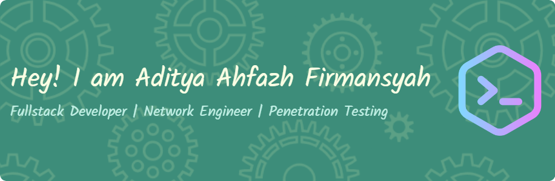

### Hello Everyone 👋

 

#### 👨‍💻 Skills

##### 🔴 Language and styles

##### 🔵 Framework and Library

##### 🟢 Database

##### 🟡 Tools

 
 

#### 📁 Socials

   

 
 
 

#### 🐈 Github Stats

<!--
**Alphby48/Alphby48** is a ✨ _special_ ✨ repository because its `README.md` (this file) appears on your GitHub profile.

Here are some ideas to get you started:

- 🔭 I’m currently working on ...
- 🌱 I’m currently learning ...
- 👯 I’m looking to collaborate on ...
- 🤔 I’m looking for help with ...
- 💬 Ask me about ...
- 📫 How to reach me: ...
- 😄 Pronouns: ...
- ⚡ Fun fact: ...
  -->

#### 💻 Tech Stack:

 

#### 📊 GitHub Stats:

 
 

#### 🏆 GitHub Trophies

---

<!-- Proudly created with GPRM ( https://gprm.itsvg.in ) -->

<h4 align="left">🎮 Play Games</h4>

###

<picture>
  <source media="(prefers-color-scheme: dark)" srcset="https://raw.githubusercontent.com/Alphby48/Alphby48/output/pacman-contribution-graph-dark.svg">
  <source media="(prefers-color-scheme: light)" srcset="https://raw.githubusercontent.com/Alphby48/Alphby48/output/pacman-contribution-graph.svg">
  
</picture>

###

###
